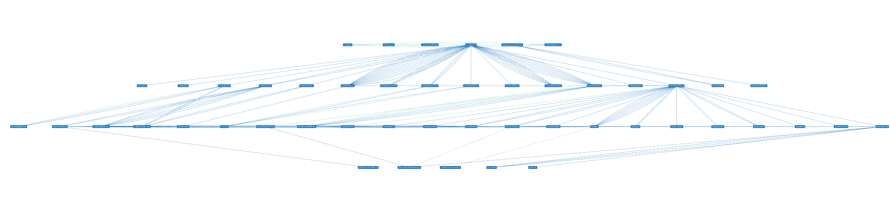
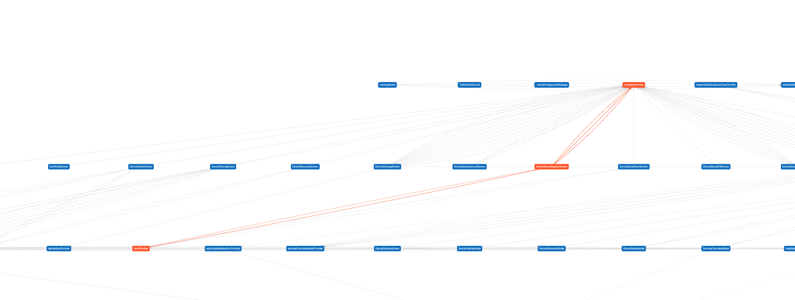
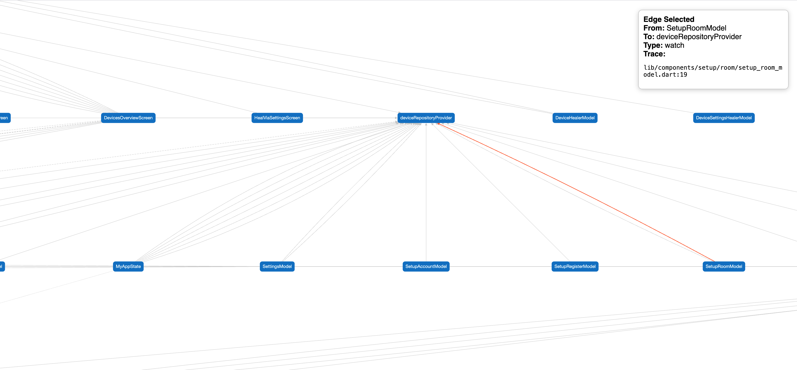

# 📊 Riverpod Graph

A static analysis tool that visualizes dependencies between your Riverpod providers using an interactive graph powered by [Cytoscape.js](https://js.cytoscape.org).  
Great for understanding complex state relationships in your Flutter app.

_(This tool was written in a rage-filled 30-minute session after trying to debug a complex Riverpod app for hours. It's probably not perfect.)_

[](https://pub.dartlang.org/packages/riverpod_graph)

---

## ✨ Features

- Visualizes `ref.watch`, `ref.read`, and `ref.listen` dependencies.
- Detects `.notifier` and `Provider.family(...)` usage.
- Displays file paths and line numbers for traceability.
- Outputs a self-contained, interactive HTML file powered by Cytoscape.js.
- Select nodes to highlight all connected edges and dependencies.
- Select edges to view detailed information in a side panel.
- Works as a CLI tool or build step.

---

## 📦 Installation

You can install the package globally using the following command:

```bash
dart pub global activate riverpod_graph
```

> Make sure `$HOME/.pub-cache/bin` is in your `PATH` so you can use `riverpod_graph` from the command line.

---

## 🚀 Usage

Run the tool in your project directory:

```bash
riverpod_graph
```

This will:

1. Analyze all Dart files under `lib/`
2. Detect providers and their dependencies
3. Output a `riverpod_graph.html` file in the current directory

Then open `riverpod_graph.html` in your browser to explore the interactive graph.

---

## 🖼️ Example Screenshots

### Full Graph View  


### Selected Node Highlights Dependencies  


### Edge Selection Displays Extra Info  


---

## 🔍 Graph Legend

| Access Type       | Edge Style     | Description                                  |
|-------------------|----------------|----------------------------------------------|
| `ref.watch`       | Solid blue     | Tracks updates                               |
| `ref.read`        | Dashed green   | Reads once                                   |
| `ref.listen`      | Dotted orange  | Listens for changes with callbacks           |

- Nodes are sized automatically and labeled with provider names.
- File and line number shown in tooltips and info panel.

---

## 📄 License

MIT License – use it freely, credit appreciated.
