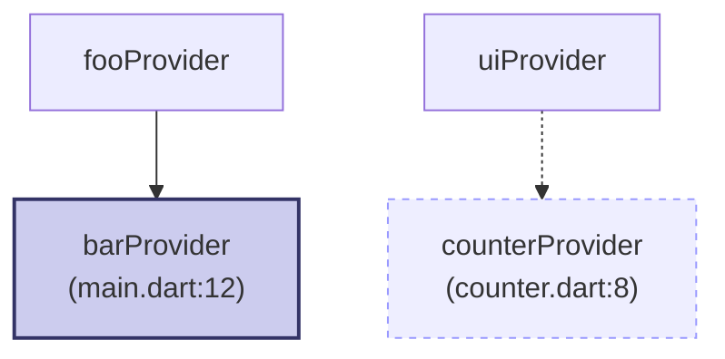

# 📊 Riverpod Graph

A static analysis tool that visualizes dependencies between your Riverpod providers using UML-style graphs powered by [Mermaid](https://mermaid.js.org). Great for understanding complex state relationships in your Flutter app.

[](https://pub.dartlang.org/packages/riverpod_graph)
---

## ✨ Features

- Visualizes `ref.watch`, `ref.read`, and `ref.listen` dependencies.
- Detects `.notifier` and `Provider.family(...)` usage.
- Displays file paths and line numbers for traceability.
- Outputs a self-contained `.html` file with Mermaid live preview.
- Works as a CLI tool or build step.

---

## 📦 Installation

You can install the package globally using the following command:

```bash
dart pub global activate riverpod_graph
```

> Make sure `$HOME/.pub-cache/bin` is in your `PATH` so you can use riverpod_graph from the command line.

---

## 🚀 Usage

Run the tool in your project directory:

```bash
riverpod_graph .
```

This will:

1. Analyze all Dart files under `lib/`
2. Detect providers and their dependencies
3. Output a `riverpod_graph.html` file in the current directory
4. Include traceability info like file and line number

---

## 📂 Example Output (Mermaid syntax)



Open `riverpod_graph.html` in your browser to view the graph.

---

## 🔍 Graph Legend

| Access Type     | Arrow Symbol | Mermaid Class | Style           |
|-----------------|--------------|----------------|------------------|
| `ref.watch`     | `-->`        | `watch`        | Solid edge       |
| `ref.read`      | `-.->`       | `read`         | Dashed edge      |
| `ref.listen`    | `==>>`       | `listen`       | Bold+Dashed edge |
| `.notifier`     | Detected     | —              | Label includes it |
| `Provider.family` | Detected   | —              | Normal edge      |

---

## 📄 License

MIT License – use it freely, credit appreciated.

---

